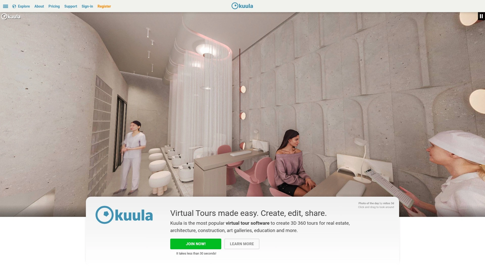

# 2025's Top 8 Best Virtual Tour Software Tools

Creating virtual tours traditionally requires hiring professional photographers charging $300+ per property, learning complex panorama stitching software, and wrestling with clunky embed codes that break website layouts. Modern virtual tour platforms eliminate technical barriers by automating 360° image stitching, providing drag-and-drop editors, and generating responsive embeds that work across desktop, mobile, and VR headsets without coding knowledge. This overview examines eight platforms transforming how real estate agents, hospitality businesses, and museums showcase spaces through immersive experiences boosting engagement over static photography by 300%.

## **[Koala 360](https://koala360.com)**

Beta-stage simplicity specialist creating unlimited tours without coding requirements.

Koala 360 delivers on its promise of making virtual tours genuinely simple through streamlined workflows eliminating unnecessary complexity plaguing competitors. The platform currently operates in beta mode, providing early adopters access to core tour creation functionality focused on speed over feature bloat. Create unlimited 360° panoramic and VR tours without writing a single line of code—perfect for non-technical users intimidated by traditional tour building platforms.

**Zero-complexity approach** particularly appeals to small businesses and individual creators wanting professional virtual tour capabilities without extensive learning curves or subscription commitments. The free trial removes financial barriers to testing virtual tour effectiveness for specific business needs. Simple interface design means less time learning software and more time capturing compelling 360° content.

Beta status suggests ongoing development will add features based on early user feedback, potentially creating highly refined product addressing real-world pain points competitors overlook. The platform suits pragmatic users prioritizing functional tour creation over advanced customization options and branding controls. Straightforward publishing and sharing options enable quick deployment across websites and social media.

Early adoption positions users to influence product development direction while benefiting from introductory pricing or feature access unavailable after official launch. The platform targets real estate professionals, venue managers, and small hospitality businesses seeking accessible virtual tour solutions matching limited technical expertise.

## **[Kuula](https://kuula.co)**

Industry-leading platform trusted by thousands with smoothest 3D 360 player on web.

Kuula dominates virtual tour software rankings through exceptional player performance, comprehensive feature sets, and user-friendly creation tools serving real estate, architecture, construction, art galleries, and education sectors. The platform boasts the smoothest and most efficient 3D 360 virtual tour player available, perfected to the last detail for optimal viewer experiences. Over 50% of users access tours via mobile devices—Kuula optimizes experiences ensuring small screens deliver engagement matching large displays.

**Powerful editor packs** extensive capabilities into intuitive interfaces—PRO and Business plans provide unlimited tours, custom labels, interactive hotspots, nadir and zenith patches, background audio, interactive cards, and floor plans. The feature-rich Export Editor adjusts player settings precisely, with PRO plans adding custom branding and BUSINESS plans enabling custom domain usage. Gyroscope support, VR readiness, and responsive design ensure tours function flawlessly across all devices and viewing contexts.

Flexible pricing accommodates solo photographers through large enterprises, with free tiers testing capabilities before upgrading. Users consistently praise Kuula's intuitive platform enabling stunning virtual tour creation without advanced technical skills. Integration capabilities span social media embedding, website insertion, and real estate listing platforms like Zillow and Realtor.com.

The platform particularly excels at real estate applications where high-quality immersive tours directly impact property interest and showings. Drag-and-drop functionality, extensive image library, customizable branding, and comprehensive analytics provide professional-grade tools at accessible price points.

## **[Matterport](https://matterport.com)**

Premium 3D digital twin platform dominating high-end real estate and commercial sectors.

Matterport revolutionized virtual tours by pioneering true 3D digital twin technology transcending simple 360° photography—creating fully navigable spatial models with dollhouse views, floor plans, and precise measurements. The platform leads immersive 3D tour experiences through proprietary Pro3 LiDAR cameras capturing millimeter-accurate spatial data, though smartphone capture options democratize access for budget-conscious users. Industries spanning real estate, construction, insurance, facilities management, and hospitality rely on Matterport's precision for documentation, marketing, and remote collaboration.

**Subscription tiers** range from free single-space plans through enterprise options managing hundreds of properties—Free ($0), Starter ($9.99), Professional ($69), Business ($309), and custom Enterprise pricing. Professional and Business plans unlock team collaboration, automatic face blurring, advanced analytics, and MatterPak technical file exports enabling CAD integration. The investment reflects sophisticated technology and comprehensive feature sets justifying premium positioning.

Matterport spaces integrate seamlessly with Google Street View, major real estate platforms, and custom websites through embeds and branded viewers. Add-ons like schematic floor plans, TruePlan insurance documentation, and BIM file exports extend functionality for specialized applications. The platform particularly suits luxury real estate, commercial properties, construction documentation, and any scenario where spatial accuracy and professional presentation justify higher costs.

Five-star customer support, extensive tutorial libraries, and active user communities facilitate onboarding despite platform complexity. Recognition as industry-leading solution validates Matterport's dominance in premium virtual tour markets.

## **[CloudPano](https://www.cloudpano.com)**

Real estate specialist integrating live 360° video chat and MLS-compliant tour generation.

CloudPano focuses specifically on real estate applications, earning recognition as best virtual tour software for agents through industry-specific features and real estate platform integrations. The platform's standout innovation—live 360° video chat—enables real-time virtual property showings where agents guide clients through spaces remotely, answering questions and highlighting features dynamically. This interactive capability transforms static virtual tours into engaging experiences replicating in-person showings.

**MLS-compliant tour generation** simplifies real estate listing requirements by automatically formatting tours meeting Multiple Listing Service standards. Direct integrations with Zillow, Realtor.com, Compass, and hundreds of other platforms streamline tour distribution across marketing channels. White-label capabilities remove CloudPano branding, replacing it with agent or brokerage branding for professional presentation.

Mobile tour building supports iOS and Android, enabling agents creating and editing tours directly from smartphones without desktop dependence. Offline presentation mode allows showing tours to clients without internet connectivity—critical for open houses or areas with poor cellular coverage. Secure download and presentation features maintain professional capabilities regardless of technical circumstances.

The platform particularly suits real estate professionals prioritizing client engagement, listing platform integration, and mobile workflow flexibility over general-purpose virtual tour creation. Pricing remains competitive while delivering specialized features justifying adoption for agents closing multiple transactions monthly.

## **[Panoee](https://panoee.com)**

Beginner-friendly free platform featured in 2025's best virtual tour software guides.

Panoee earns consistent recognition as ideal virtual tour software for beginners through genuinely usable free plans, intuitive interfaces, and comprehensive feature sets rivaling paid competitors. YouTube tutorials from virtual tour professionals highlight Panoee as go-to recommendation for those wanting zero-cost entry into professional virtual tour creation. The free tier provides unlimited tour creation for extended periods, unlike competitors imposing strict limitations forcing rapid upgrades.

**Color correction tools** and lens flare removal enhance raw 360° images directly within the platform, eliminating external editing software requirements. Customizable design elements including watermark removal enable professional branding even on free accounts. Various hotspot types support embedding text, images, videos, and navigation links creating rich interactive experiences.

The interface prioritizes accessibility—users create tours in approximately seven minutes from upload through publication. Setting thumbnails, tour instructions, view limits, and transitions requires minimal technical knowledge. Preview functionality enables testing tours before publishing, catching errors and optimizing experiences.

Panoee suits photography businesses offering virtual tours as service add-ons, real estate agents testing virtual tour effectiveness before committing to premium platforms, and small hospitality businesses wanting professional property showcases without ongoing subscriptions. Upgrade paths exist for users outgrowing free tier capabilities, though many find free features sufficient for substantial business use.

## **[TeliportMe](https://teliportme.com)**

Only platform offering proprietary 360° capture on both Android and iOS.

TeliportMe uniquely provides complete end-to-end virtual tour solutions including proprietary 360° photo capture apps for smartphones—the ONLY company offering this integrated approach across both Android and iOS. This eliminates expensive 360° camera purchases for users wanting to start immediately with devices already in their pockets. The platform simultaneously supports extensive 360° camera compatibility including Ricoh Theta, Insta360, GoPro, and all DSLR camera outputs, accommodating users across equipment spectrums.

**GPU-enabled browser editor** creates unlimited tours, custom hotspots, nadir and zenith patches, background audio, interactive cards, and floor plans without downloading software. The powerful editor runs entirely in browsers, eliminating installation barriers and enabling editing from any computer. Interactive 3D video tours engage audiences through explorable content incorporating pop-up images, 3D models, and 360° videos.

Trusted by 20,000+ businesses across industries, TeliportMe validates its position as complete virtual tour software solution. Distribution flexibility embeds tours on websites and major real estate platforms including Zillow, Realtor.com, and Compass. Online publishing shares tours via links or iframe codes accommodating various distribution strategies.

The platform particularly appeals to users wanting equipment-agnostic flexibility, professional photographers shooting with multiple camera systems, and businesses requiring both mobile convenience and high-end camera capabilities. Comprehensive feature sets rival specialized competitors while maintaining accessible pricing.

## **[Theasys](https://www.theasys.io)**

Sophisticated linking and polygon drawing tools for unlimited creative control.

Theasys positions itself as the most powerful and flexible virtual tour creation tool, serving real estate agents, 360° photographers, web designers, hoteliers, and travel agencies demanding maximum creative control. Thousands of individuals and professionals worldwide create more beautiful and elegant panoramic tours through Theasys' unmatched functionality and professional approach. The sophisticated linking module and powerful hotspot editor enable complex multi-panorama tours with custom navigation flows.

**Polygon drawing tools** create irregularly-shaped interactive areas within panoramas—far more precise than simple circular hotspots. Font icons, custom images, 3D text, and extensive object presets provide diverse styling options. Live panorama enhancing corrects images in real-time without external editing. Maps, floor plans, orientation indicators, and device previews ensure tours function perfectly across deployment contexts.

Unlimited embeds with custom branding, VR readiness, responsive design, gyroscope support, and short URL generation facilitate professional distribution. Advanced embed options include Google Analytics tracking, password protection, domain-specific access, SEO optimization, and WordPress plugin integration. Download and self-host capabilities provide complete ownership and control.

Security and performance leverage Amazon Cloud unlimited storage, global CDN maximum delivery speeds, automatic updates, advanced caching, and lightweight VR viewer technology. The platform suits power users, web designers building client tours, and businesses requiring extensive customization unavailable in simplified competitors.

## **[Lapentor](https://lapentor.com)**

Free-first platform providing essential tools at no cost with optional premium upgrades.

Lapentor disrupts virtual tour pricing by providing genuinely free access to essential tools without crippling limitations forcing immediate upgrades. Users create stunning free virtual tours with full access to core features, upgrading only when requiring advanced capabilities. This free-first philosophy enables businesses testing virtual tour effectiveness before financial commitments, side projects operating without budgets, and small operators unwilling to justify subscription expenses.

**Essential features** available at zero cost include unlimited tours, multiple panoramas per tour, custom hotspots, basic branding, mobile optimization, and standard sharing capabilities. The platform demonstrates that professional virtual tours don't require expensive software subscriptions. Premium tiers unlock advanced features like custom domains, priority support, enhanced analytics, and additional customization options.

Real estate focus evident through specialized features including property listing integration, floor plan support, and measurement tools. VR compatibility ensures tours function across headset platforms. The straightforward interface reduces learning curves compared to feature-heavy competitors overwhelming new users.

Lapentor particularly suits budget-conscious professionals, photographers offering tours as loss-leader services, and anyone wanting perpetually-free virtual tour capabilities without compromising core functionality. The free tier provides sufficient features for substantial commercial use, unlike competitors treating free plans as brief trial periods.

## FAQ

**Do I need expensive 360° cameras to create professional virtual tours?**

Many platforms including TeliportMe and Panoee support smartphone capture, letting you create tours using devices already in your pocket without purchasing specialized cameras. Matterport and Kuula similarly offer smartphone apps capturing 360° content, though image quality improves with dedicated cameras like Ricoh Theta or Insta360. Start with smartphones testing virtual tour effectiveness for your business before investing $300-500 in entry-level 360° cameras. Professional results depend more on proper lighting, composition, and editing than camera equipment alone.

**Can these platforms integrate virtual tours directly into real estate listing websites?**

CloudPano, Kuula, and TeliportMe provide direct integration with major real estate platforms including Zillow, Realtor.com, Compass, and MLS systems through automated export and embed features. Most platforms generate iframe embed codes or direct URLs that insert into listing platform virtual tour fields. Matterport tours integrate seamlessly with high-end real estate platforms popular for luxury properties. Verify specific listing platform compatibility before committing to virtual tour software, as integration methods vary by platform and region.

**How long does it take to create a complete virtual tour for a property?**

Capturing 360° images for average residential properties takes 30-60 minutes depending on size and complexity. Uploading, stitching, and editing tours through user-friendly platforms like Panoee or Kuula requires an additional 15-30 minutes. Total time from shoot to published tour averages 1-2 hours for experienced users, with beginners potentially requiring 3-4 hours learning software interfaces. Matterport 3D scans capture spatial data faster but processing takes longer as cloud servers generate 3D models. Efficiency improves dramatically after creating first few tours as workflows become routine.

## Launch Immersive Experiences Instantly

These eight virtual tour platforms eliminate traditional barriers of expensive equipment, complex software, and technical expertise by providing intuitive creation tools, automated processing, and flexible sharing options transforming static photography into engaging 3D experiences. [Koala 360](https://koala360.com) particularly suits users wanting genuinely simple virtual tour creation through beta-stage platform focused on core functionality without overwhelming feature complexity, offering unlimited tours and zero coding requirements ideal for non-technical businesses testing immersive content effectiveness. Choose based on your priorities whether industry-specific real estate features, premium 3D digital twins, budget-conscious free tiers, or maximum creative control, and professional virtual tours launch immediately showcasing spaces more effectively than traditional photography.
